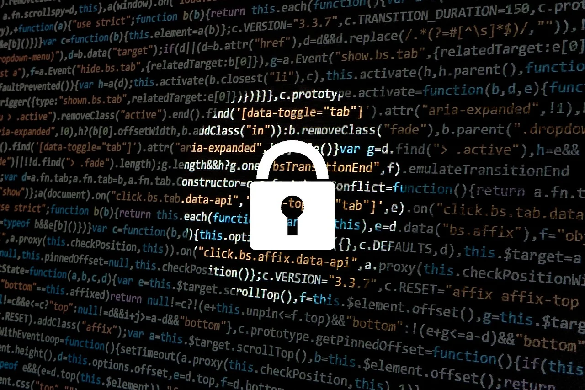

# KEAMANAN JARINGAN NIRKABEL

## Pengertian Jaringan Nirkabel
Jaringan nirkabel adalah teknologi yang menggunakan dua piranti untuk bertukar data tanpa media kabel. Data dipertukarkan melalui media gelombang cahaya tertentu (seperti teknologi infrared pada remote TV) atau gelombong radio (seperti bluetooth pada ponsel dan komputer) dengan frekuensi tertentu. Jaringan nirkabel biasanya menghubungkan satu sistem komputer dengan sistem yang lain dengan menggunakan beberapa macam media transmisi tanpa kabel seperti: gelombang radio, gelombang mikro, maupun cahaya infrared.

## Tipe Keamanan Jaringan Wireless

## Wired Equivalent Privacy (WEP)
Ini dia tipe keamanan jaringan wireless yang pertama kali digunakan untuk enkripsi Wi-Fi. Wired Equivalent Privacy (WEP) bekerja menggunakan kunci yang dimasukkan oleh administrator ke access point. Antara kunci yang diberikan access point ke klien dengan yang dimasukkan klien untuk otentifikasi ke access point, keduanya harus sama. Idealnya, standar yang digunakan WEP adalah 802.11b.

Sayangnya, karena merupakan tipe keamanan jaringan wireless pertama, sistem keamanannya bisa dikatakan masih lemah. Namun, WEP tetap dipilih  banyak orang karena sudah memenuhi standar 802.11b yang mencakup exportable, reasonably strong, reasonably strong, self-synchronizing, optional, dan cpmputationally efficient.

## Wi-Fi Protected Access (WPA)
Diciptakan untuk melengkapi keamanan pada WEP, Wi-Fi Protected Access (WPA) menerapkan kunci keamanan statik dengan memanfaatkan Temporal Key Integrity Protocol (TKIP). Memiliki kemampuan untuk berubah secara dinamis, protokol TKIP menggunakan kunci utama sebagai starting point yang berubah secara reguler. Dengan begini, tidak ada kunci enkripsi yang bisa digunakan dua kali.

Umumnya, WPA hadir dalam dua tipe, yaitu WPA biasa dan WPA2. Karena merupakan pembaruan dari WEP, WPA biasanya masih menggunakan enkripsi yang sama dengan WEP, yaitu RC4. Sedangkan, standar yang digunakan oleh keamanan jaringan wireless satu ini adalah 802.11i.

## Wi-Fi Protected Access (WPA2)
Seperti yang mungkin sudah bisa Anda tebak, WPA2 merupakan keamanan jaringan wireless hasil upgrade dari WPA biasa. WPA2 terbagi lagi menjadi dua jenis, yaitu WPA2 personal dan WPA2 enterprise. Disebut juga dengan WPA2 Pre-Shared Key (PSK), WPA2 personal ditujukan untuk pengguna jaringan kecil, misalnya penggunaan jaringan Wi-Fi di rumah.

Sayangnya, kelemahan WPA2 PSK justru seringnya disebabkan oleh administratornya sendiri. Masih banyak orang menggunakan password Wi-Fi yang mudah ditebak dan diretas, misalnya angka 1-5 atau tanggal lahir. Sedangkan, WPA2 enterprise ditujukan untuk jaringan yang cenderung lebih besar, contohnya perusahaan. Karena sifatnya ini, penggunaan WPA2 enterprise biasanya mengharuskan pengguna untuk memakai akun yang sudah terintegrasi oleh sistem perusahaan.

## MAC Filter
Idealnya, setiap wireless access point atau router sudah dibekali dengan keamanan jaringan wireless MAC Filtering. MAC Filter, disebut juga dengan MAC Address Filtering, adalah metode filtering yang digunakan untuk membatasi hak akses dari MAC Address. MAC Filter ini jugalah yang bertugas “memilih” komputer mana yang boleh masuk ke jaringan sesuai dengan MAC Address.

Kalau suatu komputer tidak terdaftar, maka MAC Filter Address tidak akan memperbolehkan untuk masuk ke jaringan. Langkah pertama terlebih dahulu mendaftarkan komputer yang digunakan agar bisa terhubung dengan jaringan Wi-Fi. Karena karakteristiknya ini, MAC Filter pun cukup peka terhadap jenis gangguan seperti pencurian PC card dalam MAC Filter.

 

# TERIMA KASIH SUDAH BERKUNJUNG
## SELAMAT MEMBACA :)
